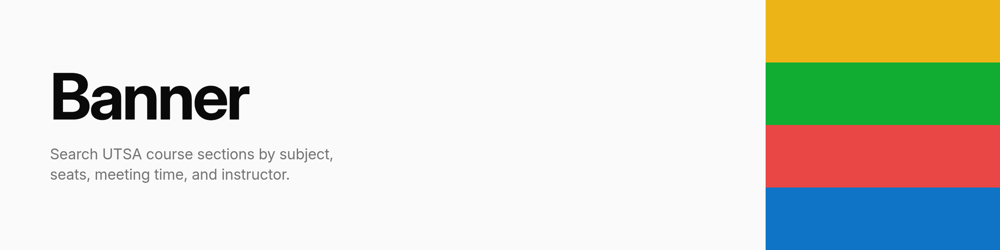

  <picture>
    <source media="(prefers-color-scheme: dark)" srcset=".github/assets/banner-dark.png">
    <source media="(prefers-color-scheme: light)" srcset=".github/assets/banner-light.png">
    
  </picture>

  
  
  
  

UTSA runs Ellucian's Banner for course registration, which is where this project gets its data and
its name. Searching it is slow, it drops your filters when you page through results, and it shows
you almost nothing about a class until you open that one class by itself.

This keeps its own continuously refreshed copy of the catalog and puts a faster search and a denser
interface on top of it. A section here means one specific offering of a course: its own CRN,
meeting time, room, and instructor.

## What it does

- **Filter down to the sections you'd actually take.** Term, subject, meeting days, time of day,
  open seats, and instructor, applied together, with the results in one table that shows all of it
  at once.
- **See how a section filled up.** Seat counts are recorded every time the scraper sees a change,
  drawn as a chart on the section's page and as a small inline chart in the results table.
- **Read a term at a glance.** The timeline page charts how many sections are in session on any
  given day of the term, stacked by subject, on a canvas you can pan and zoom.
- **Compare instructors.** RateMyProfessors and BlueBook ratings are matched to catalog instructors
  and combined into one score, with the source numbers it was built from alongside it.
- **Put a section in your calendar.** Download its meeting schedule as an `.ics` file, or send it
  straight to Google Calendar.
- **Get told when something changes.** The Discord bot can watch a section and DM you when a seat
  opens, when a waitlist spot frees up, or on any change at all.

## By the numbers

- **336K course sections, every term back to 2002.**
- **36K live sections kept current on roughly two requests a minute** to UTSA.
- **850K field changes and 700K enrollment snapshots**, each keeping the old value beside the new,
  feeding the enrollment charts and the audit log.
- **8,600 instructors, 2,900 matched to RateMyProfessors**, against 72K reviews and 33K BlueBook
  course evaluations.

## How it works

One Rust binary runs the web server, the scraper, the Discord bot, and a supervised Node process
for SvelteKit's SSR. Queries live in a single data layer and are verified against the schema at
compile time; the TypeScript types the frontend uses are generated from the Rust structs, so the
two halves cannot drift without the build saying so.

The scraper's job queue is a Postgres table rather than an in-process schedule, so work survives a
restart and can be inspected with a query. Intervals track how often a subject actually changes:
subjects that move get scraped more, subjects that don't get left alone. That is what keeps the
request count against UTSA as low as it is.

[`docs/ARCHITECTURE.md`](docs/ARCHITECTURE.md) covers the structure, and
[`docs/BANNER.md`](docs/BANNER.md) covers what we've worked out about Ellucian's API by watching
it: how sessions are minted and expire, and why an invalid one answers `200 OK` with an empty
result rather than an error.

## Stack

**Backend.** [Axum](https://github.com/tokio-rs/axum) for HTTP and WebSocket handlers,
[SQLx](https://github.com/launchbadge/sqlx) for compile-time verified queries against
[PostgreSQL](https://www.postgresql.org/), and [Serenity](https://github.com/serenity-rs/serenity)
with [Poise](https://github.com/serenity-rs/poise) for the Discord bot.
[governor](https://github.com/boinkor-net/governor) rate limits outbound requests to UTSA,
with separate budgets for session, search, and metadata calls.

**Frontend.** [SvelteKit](https://svelte.dev/docs/kit) and [Svelte 5](https://svelte.dev) with
runes, [Tailwind CSS v4](https://tailwindcss.com) for styling,
[bits-ui](https://bits-ui.com) for headless primitives,
[TanStack Table](https://tanstack.com/table) for the results table,
[d3](https://d3js.org) driving the timeline canvas directly, and
[LayerChart](https://layerchart.com) for the enrollment charts.
[ts-rs](https://github.com/Aleph-Alpha/ts-rs) generates the type bindings between the two halves.

**Infrastructure.** Built into a single container image and deployed to
[k3s](https://k3s.io) with [Helm](https://helm.sh). Metrics are exposed for
[Prometheus](https://prometheus.io) and scraped into
[VictoriaMetrics](https://victoriametrics.com), with logs in
[VictoriaLogs](https://docs.victoriametrics.com/victorialogs/).

## Development

`just --list` is the entry point; `just check` runs everything CI does. Conventions are in
[`docs/`](docs/README.md).

## License

[AGPL-3.0](LICENSE).
